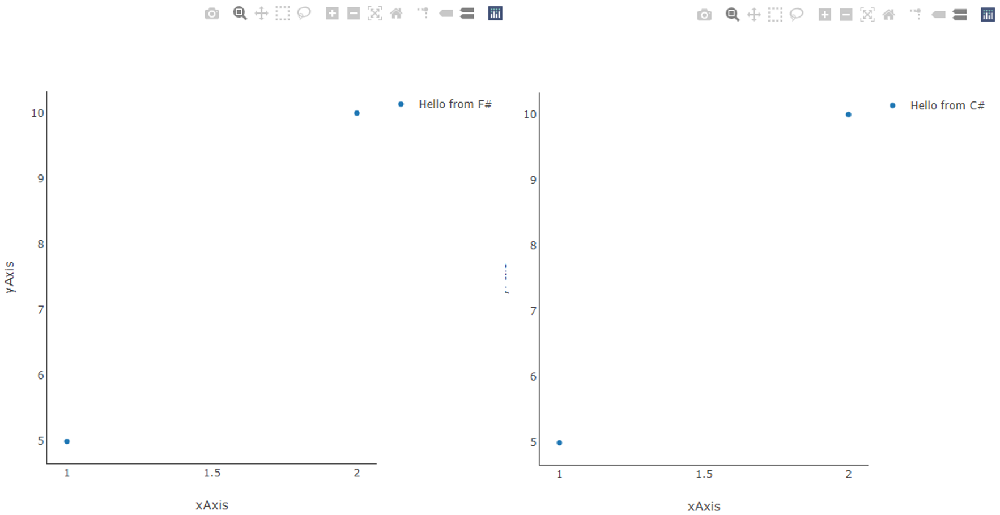

# Plotly.NET

Formerly FSharp.Plotly, Plotly.NET provides functions for generating and rendering Plotly.js Charts in .NET. The main design point of 
it is to provide support for multiple flavors of chart generation. Here are 2 examples in different styles and languages that create an equivalent Chart:

 - **Functional pipeline style in F#:**
    ```F#
    [(1,5);(2,10)]
    |> Chart.Point
    |> Chart.withTraceName("Hello from F#",Showlegend=true)
    |> Chart.withY_AxisStyle("xAxis",Showgrid= false, Showline=true)
    |> Chart.withX_AxisStyle("yAxis",Showgrid= false, Showline=true)
    |> Chart.Show
    ``` 

 - **Fluent interface style in C#:**
    ```C#
    static void Main(string[] args)
    {
        double[] x = new double[] { 1, 2 };
        double[] y = new double[] { 5, 10 };
        GenericChart.GenericChart chart = Chart.Point(x: x, y: y);
        chart
            .WithTraceName("Hello from C#", true)
            .WithX_AxisStyle(title: "xAxis", Showgrid: false, Showline: true)
            .WithY_AxisStyle(title: "yAxis", Showgrid: false, Showline: true)
            .Show();
    }
    ```
 - **Declarative style in F# using the underlying `DynamicObj`:**
    ```F#
    let xAxis = 
        let tmp = Axis.LinearAxis()
        tmp?title <- "xAxis"
        tmp?showgrid <- false
        tmp?showline <- true    
        tmp

    let yAxis =
        let tmp = Axis.LinearAxis()
        tmp?title <- "yAxis"
        tmp?showgrid <- false
        tmp?showline <- true    
        tmp

    let layout =
        let tmp = Layout()
        tmp?xaxis <- xAxis
        tmp?yaxis <- yAxis
        tmp?showlegend <- true
        tmp

    let trace = 
        let tmp = Trace("scatter")
        tmp?x <- [1;2]
        tmp?y <- [5;10]
        tmp?mode <- "markers"
        tmp?name <- "Hello from F#"
        tmp

    GenericChart.ofTraceObject(trace)
    |> GenericChart.setLayout layout
    |> Chart.Show
    ```

 - **Declarative style in C# using the underlying `DynamicObj`:**
    ```C#
    static void Main(string[] args)
    {
        double[] x = new double[] { 1, 2 };
        double[] y = new double[] { 5, 10 };

        Axis.LinearAxis xAxis = new Axis.LinearAxis();
        xAxis.SetValue("title", "xAxis");
        xAxis.SetValue("showgrid", false);
        xAxis.SetValue("showline", true);

        Axis.LinearAxis yAxis = new Axis.LinearAxis();
        yAxis.SetValue("title", "yAxis");
        yAxis.SetValue("showgrid", false);
        yAxis.SetValue("showline", true);

        Layout layout = new Layout();
        layout.SetValue("xaxis", xAxis);
        layout.SetValue("yaxis", yAxis);
        layout.SetValue("showlegend", true);

        Trace trace = new Trace("scatter");
        trace.SetValue("x", x);
        trace.SetValue("y", y);
        trace.SetValue("mode", "markers");
        trace.SetValue("name", "Hello from C#");

        GenericChart
            .ofTraceObject(trace)
            .WithLayout(layout)
            .Show();
    }
    ```



Documentation
=============

The documentation can be found [here.](http://plotly.github.io/Plotly.NET/)
The documentation for this library is automatically generated (using FSharp.Formatting) from *.fsx and *.md files in the docsrc folder. If you find a typo, please submit a pull request!


Library license
===============

The library is available under the [MIT license](https://github.com/plotly/Plotly.NET/blob/dev/LICENSE).
